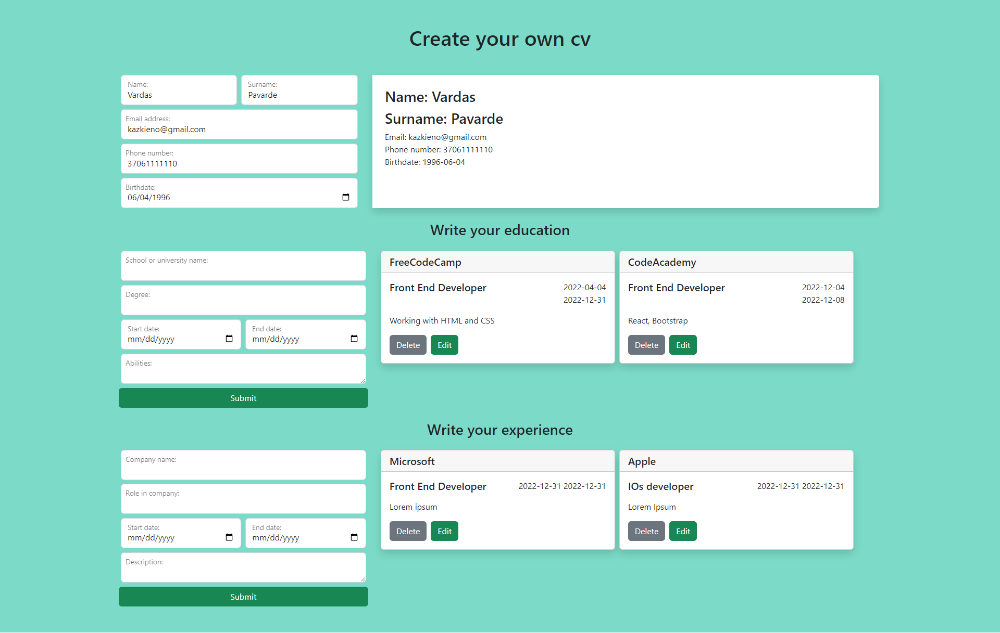

Open directory in your computer and in Terminal `npm start` 
In browser open: localhost:3000 
that how you can open project.

It`s simple project where you can create your cv

Demo image of it: 

you can edit your education or expierence card and it looks like it: 

